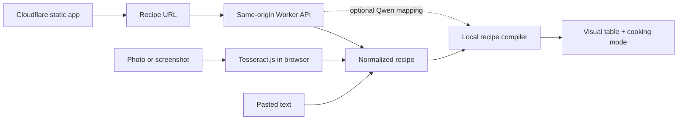

# RecipeTable

RecipeTable turns a recipe URL, photo, screenshot, or pasted recipe into a compact visual cooking flow. Ingredients appear in the order they are used, and each action spans the ingredients or intermediate mixture it operates on.

The product is local-first and intentionally cheap to operate:

- One Cloudflare Worker serves the static React PWA and the recipe API from the
  same origin.
- Tesseract.js performs photo OCR inside the browser; recipe images are never uploaded. Its Worker, WebAssembly core, and English model are self-hosted with the app.
- The Worker fetches user-requested recipe URLs and extracts their Schema.org recipe card.
- A deterministic compiler maps ingredients to steps in the browser.
- An optional Qwen model on Cloudflare Workers AI refines ambiguous mappings.
- Recent recipes are stored in `localStorage`. There is no account system or database.

## Architecture



## What is implemented

- URL import using JSON-LD, `@graph`, `HowToSection`, Microdata, and RDFa-style `itemprop` fallbacks
- Canonical source, author, site, image, yield, and ISO-8601 time extraction
- Browser-only image preprocessing and Tesseract OCR
- OCR/text section inference when headings are missing
- Ingredient quantity, unit, preparation, and optional-item parsing
- Deterministic ingredient-to-step mapping with grouped dry/wet ingredient support
- Optional schema-constrained Workers AI refinement
- Responsive Cooking-for-Engineers-inspired table with an original visual system
- Full-screen cooking mode with per-stage ingredients and timers
- Inline recipe correction
- PNG and spreadsheet-friendly TSV export
- Local recent-recipe persistence
- Installable PWA and offline application shell
- SSRF defenses, redirect validation, response size limits, fetch timeouts, CORS allowlisting, and edge caching

## Local development

Requirements:

- Node.js 22 or newer
- A Cloudflare account for URL import and optional AI mapping

Install and start the frontend:

```bash
npm install
cp .env.example .env.local
npm run dev
```

Image and pasted-text imports work without the Worker. URL import becomes available after `VITE_RECIPE_WORKER_URL` is set.

Start the Worker locally in another terminal:

```bash
npm run worker:dev
```

The default local Worker origin is `http://localhost:8787`. Set this in `.env.local`:

```dotenv
VITE_RECIPE_WORKER_URL=http://localhost:8787
VITE_ENABLE_AI_COMPILER=false
```

## Deploy from GitHub to Cloudflare

The production app is one Cloudflare Worker: static assets are served before the
Worker script, while `/health`, `/extract`, and `/compile` run through the API.
No production environment variables or cross-origin configuration are required.

From a phone or desktop:

1. Open **Cloudflare Dashboard → Workers & Pages → Create application**.
2. Choose **Import a repository**, connect GitHub, and select
   `nroze22/RecipeTable`.
3. Use `main` as the production branch.
4. Keep the root directory at `/`.
5. Set the build command to `npm run build`.
6. Set the deploy command to `npx wrangler deploy`.
7. Set the Worker name to `recipe-table`, matching
   [`wrangler.jsonc`](wrangler.jsonc).
8. Save and deploy.

Cloudflare provides a URL similar to:

```text
https://recipe-table.<account-subdomain>.workers.dev
```

Each later push to `main` builds and deploys automatically. A custom domain can
be added from **Workers & Pages → recipe-table → Settings → Domains & Routes**.

The Worker configuration binds Workers AI as `AI` and defaults to:

```text
@cf/qwen/qwen3-30b-a3b-fp8
```

Automatic AI refinement remains off unless `VITE_ENABLE_AI_COMPILER=true` is
defined during the frontend build. Users can still request the optional pass
with **Smart Map**. The deterministic compiler and every other core feature work
without AI.

For a command-line deployment instead, authenticate Wrangler and run:

```bash
npx wrangler login
npm run deploy
```

The Worker exposes:

- `GET /health`
- `POST /extract` with `{ "url": "https://…" }`
- `POST /compile` with the normalized recipe arrays

## Validation

Run the same checks used in CI:

```bash
npm run check
npm test
npm run build
```

The fixtures cover nested JSON-LD, `HowToSection` flattening, Microdata fallback, OCR-like text, grouped ingredient mapping, private network addresses, credentials in URLs, malformed requests, and oversized AI payloads.

## Extraction behavior

RecipeTable does not send an entire web page to a language model. The Worker:

1. Validates the URL and every redirect.
2. Fetches at most 3 MB of HTML with a nine-second timeout.
3. Looks for a Schema.org `Recipe`.
4. Normalizes only the recipe fields.
5. Caches the normalized result for six hours.

If a site blocks the request or does not publish structured recipe data, the UI tells the user to upload a screenshot or paste the recipe text. The Worker does not bypass bot protection, authentication, or paywalls.

## Privacy and content policy

- Uploaded images remain in browser memory and are processed by Tesseract WebAssembly.
- OCR engine files are lazily downloaded from the same Cloudflare origin on the first scan and cached by the browser.
- Raw page HTML is never returned to the frontend or stored.
- The app retains source attribution and an original-recipe link.
- Source photography is not copied into exports.
- The AI endpoint sees only normalized ingredient and step strings.
- AI output can only reference existing ingredient and step indexes; unknown values are discarded.

Recipe owners may have rights in expressive directions, photography, and compilations even where factual ingredient lists and basic procedures are not protected. Production use should keep imports user-initiated, preserve attribution, and avoid republishing long expressive passages as a public recipe catalog.

## Project structure

```text
src/
  components/       React interface, visual table, editor, cooking mode
  data/             Built-in demonstration recipe
  lib/              OCR, parsing, graph compiler, storage, export, Worker client
worker/
  src/ai.ts         Optional Workers AI mapping pass
  src/extract.ts    Structured recipe extraction
  src/security.ts   URL validation and bounded fetch
  src/index.ts      Worker API, CORS, caching, error handling
wrangler.jsonc      Root Cloudflare Worker and Static Assets configuration
```
